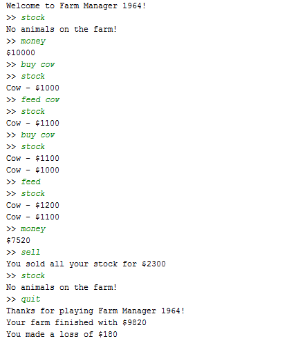
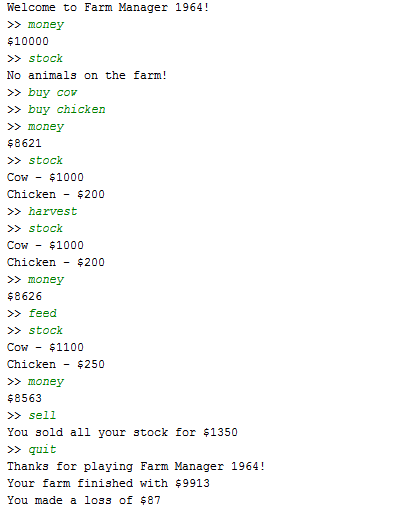

# Activity: Farm Manager 1964

## Overview
This activity requires you to modify existing classes in the provided FarmManager application. You are also required to create new classes for this game. There are eight tasks to complete. To run the game, simply run the FarmManager class.

Before starting the activity, read through and gain an understanding of the existing code.

## Details
In the FarmManager game, you can buy animals, raise them, and sell them back for a profit. Just remember don't run out of money!

Currently, the game has the following commands:
* **_buy &lt;animal name&gt;_**: buys new animals.
* **_sell_**: sells all your animals.
* **_feed_**: feeds as many animals as you have money for.
* **_feed &lt;animal type&gt;_**: feeds as many animals as you have money for that are of the given type.
* **_stock_**: lists which animals you have in stock.
* **_money_**: tells you how much money you have.
* **_harvest_**: harvests all animals that produce products.
* **_quit_**: provide a summary financial statement then exit the game.

Note that some commands will not work properly until you have implemented the required functionality. 

## Task One. UML Class Diagram
Create a UML class diagram to model the static structure of the FarmManager application. Your class diagram should capture the key classes and interfaces, and the relationships between them.

You should add your class diagram (as a PNG or JPEG) in the top level of your repository (i.e. where the README is).

## Task Two. Complete Farm Constructor
Complete the constructor of the `Farm` class which takes an integer parameter in the `Farm` class so that:
  1. `money` is initialised to the given parameter.
  2. `STARTING_MONEY` is initialised to the given parameter.
  3. The `animals` array is initialised to hold 10 `Animal` objects.

## Task Three. Complete Farm’s buyAnimal method
The `buyAnimal` method in the `Farm` class allows users to buy animals for the farm. The purchase of an animal is only successful when:
  1. The animal type exists,
  2. The money is sufficient, and
  3. The animals array is not full, i.e. the array does not contain any null elements.

The first two conditions have been implemented in the `buyAnimal` method. Now, complete the method by implementing the third condition. Here is some pseduocode to help you to complete this method:
* Go through each element in the `animals` array
  * If the element is null, assign the newly created animal to that element. Deduct the price of the animal from the money you have for the farm. Then, return true.

## Task Four. Complete Farm’s feed method
Complete the `feed` method in the `Farm` class to feed all the animals of the specified type on the farm. An animal is only fed when there is enough money to feed it. When you fed an animal, you also need to subtract the cost to feed from the money you have on the farm, and call the feed method on the animal. Don’t forget to stop going through the `animals` array when there is no more animal to feed (i.e. when the animal becomes null)!

Hint: You may use the `getType` method on the animal to get the animal type. Then, compare to see if the type of animal matches the one specified from the parameter. The match should be case insensitive.

## Task Five. Complete Farm’s printStock method
Complete the `printStock` method in the `Farm` class to print information for all animals on the farm by calling the `toString` method on each animal. If there are no animals on the farm, simply print the message `No animals on the farm!`.

Hint: There are no animals on the farm if all elements in the `animals` array are null.

After completing the first five tasks, the FarmManager game should produce similar outputs as the following example: 

## Task Six. Create New Animals
1. Create a `Chicken`  class, which extends the `Animal` class.
    * Create a private constant `int` field, which stores 300. Name the field `MAX_VALUE`.
    * Create a constructor for the `Chicken` class that does not take any parameters. Within the constructor, set the `value` for the chicken to 200.
    * Implement the `feed` method so that the `value` for the chicken increases when the chicken has been fed. The formula for increasing the `value` is:
        `value = value + (MAX_VALUE - value) / 2;`
        
        Note that the `value` of the chicken should not exceed the `MAX_VALUE`.
    * Implement the `costToFeed` method to return 3 as the cost for feeding each chicken.
    * Implement the `getType` method to return `Chicken`.
    * Implement the `toString` method so that the user knows what it is. The String should be similar to the one in the `Cow` class.

2. Create a unique type of animal, which also extends the `Animal` class. Implement the appropriate constructor and methods for your animal. Don't forget to also implement an appropriate `toString` method on your animal.

3. Modify the `getAnimal`  method in the `Farm` class appropriately to include `Chicken` and the animal type that you created previously.

## Task Seven. Collect Products from Animals
Now, we would like to make some money by harvesting products from our animals. We want to be able to milk cows and collect eggs from chickens. In order to do so, you need to do the following steps:

1. Modify the `Cow` class to implement the `IProductionAnimal`  interface. A cow can only be milked if its value has reached the maximum. The money you can make from milking a harvestable cow is $20, otherwise $0.

2. Modify the `Chicken` class to implement the `IProductionAnimal` interface. You can always collect eggs from a chicken regardless of its value. The money you can make from collecting eggs is $5.

3. Complete the `harvestAll` method in the `Farm` class so that you can make money by harvesting the products from all animals that implement the `IProductionAnimal` interface. You can only harvest an animal if it is harvestable. If the animal is harvestable, use the `harvest` method on the animal and add the money made from harvesting to the `money` you have on the farm.

Hint: use `instanceof` to determine if an animal is an instance of `IProductionAnimal`.

After completing all tasks, the `FarmManager` game should produce similar outputs as the following example:

## Task Eight. Questions
In your own words, answer the following questions. You should add your answers (as a txt or pdf) in the top level of your repository (i.e. where the README is).

1. Give an example of inheritance from this activity.
2. Briefly explain the differences between the private and protected instance variables used in this activity. Why is not every variable private in the activity?
3. Briefly explain why we cannot create an instance of the Animal class.
4. What is a key benefit of having the IProductionAnimal interface?
5. What could be the benefits and consequences of changing the Animal class to an interface?
